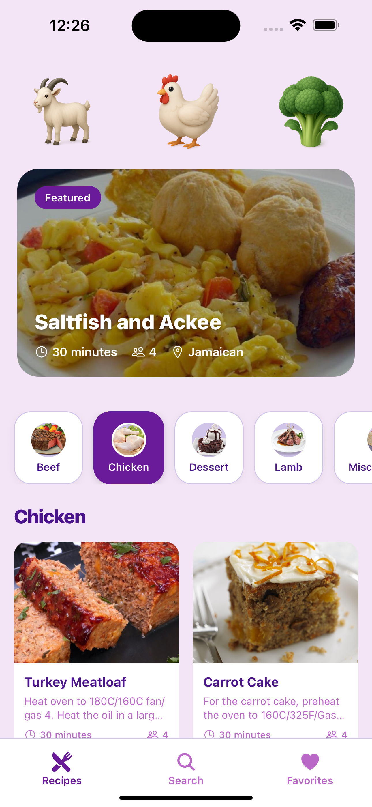
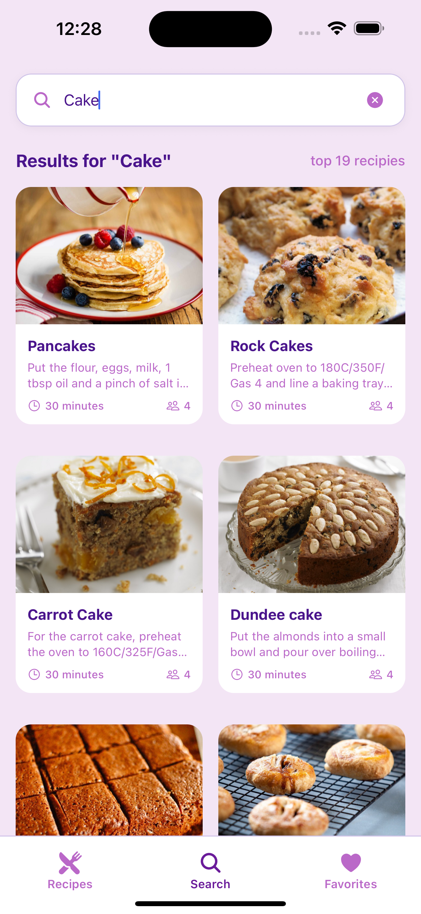
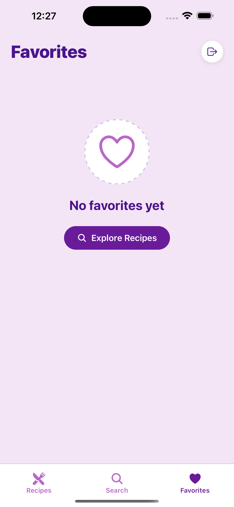
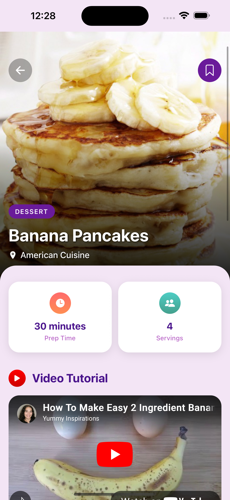
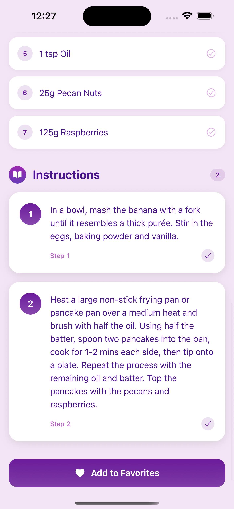

# 🍳 Recipe App Frontend

A modern, feature-rich React Native recipe application built with Expo, offering seamless recipe discovery, favorites management, and user authentication.

## ✨ Features

- 🔍 **Smart Recipe Search** - Find recipes with real-time search and debounced queries
- 📱 **Category Filtering** - Browse recipes by categories with intuitive filters
- ❤️ **Favorites Management** - Save and organize your favorite recipes
- 🔐 **User Authentication** - Secure sign-up, sign-in, and email verification
- 📖 **Detailed Recipe View** - Complete recipe information with ingredients and instructions
- 🎨 **Modern UI/UX** - Clean, responsive design with smooth animations
- 🌙 **Optimized Performance** - Efficient loading states and error handling

## 🚀 Tech Stack

### **Frontend Framework**
- **React Native** with **Expo** - Cross-platform mobile development
- **Expo Router** - File-based navigation system

### **Core Libraries**
- **React Hooks** - Modern state management and lifecycle handling
- **Custom Hooks** - Reusable logic with `useDebounce` for search optimization

### **UI & Styling**
- **StyleSheet API** - Modular styling architecture
- **Custom Components** - Reusable UI components
- **Responsive Design** - Adaptive layouts for different screen sizes

### **API Integration**
- **Fetch API** - HTTP client for external API calls
- **TheMealDB API** - Recipe data source
- **Custom API Service** - Centralized API management

### **Development Tools**
- **ESLint** - Code linting and formatting
- **TypeScript Configuration** - Type safety setup
- **Git** - Version control

## 📁 Project Structure

recipe-app-frontend/
├── app/                          # App Router pages
│   ├── (auth)/                   # Authentication screens
│   │   ├── sign-in.jsx
│   │   ├── sign-up.jsx
│   │   └── verify-email.jsx
│   ├── (tabs)/                   # Tab navigation screens
│   │   ├── index.jsx             # Home screen
│   │   ├── search.jsx            # Search screen
│   │   └── favorites.jsx         # Favorites screen
│   └── recipe/[id].jsx           # Dynamic recipe detail screen
├── components/                   # Reusable UI components
│   ├── CategoryFilter.jsx
│   ├── RecipeCard.jsx
│   ├── LoadingSpinner.jsx
│   ├── NoFavoritesFound.jsx
│   └── SafeScreen.jsx
├── services/                     # API services
│   └── mealAPI.js
├── hooks/                        # Custom React hooks
│   └── useDebounce.js
├── constants/                    # App constants
│   ├── api.js
│   └── colors.js
├── assets/                       # Static assets
│   ├── fonts/
│   ├── images/
│   └── styles/                   # Screen-specific styles
└── README.md

## 🛠️ Installation & Setup

### Prerequisites
- **Node.js** (v16 or higher)
- **npm** or **yarn**
- **Expo CLI** (`npm install -g @expo/cli`)
- **iOS Simulator** (for iOS development) or **Android Studio** (for Android)

### Quick Start

1. **Clone the repository**

   git clone <repository-url>
   cd recipe-app-frontend

2. **Install dependencies**

   npm install
   # or
   yarn install

3. **Start the development server**

   npx expo start

4. **Run on device/simulator**
   - Press `i` for iOS simulator
   - Press `a` for Android emulator
   - Scan QR code with Expo Go app on your device

## 🔧 Configuration

### Environment Setup
Create a `.env` file in the root directory:

# API Configuration
EXPO_PUBLIC_MEAL_API_BASE_URL=https://www.themealdb.com/api/json/v1/1
EXPO_PUBLIC_API_KEY=your_api_key_here

# Authentication (if using custom backend)
EXPO_PUBLIC_AUTH_API_URL=your_auth_api_url
EXPO_PUBLIC_JWT_SECRET=your_jwt_secret

### API Integration
The app uses **TheMealDB API** for recipe data:
- **Base URL**: `https://www.themealdb.com/api/json/v1/1`
- **Free tier**: No API key required
- **Endpoints used**:
  - Search recipes: `/search.php?s={query}`
  - Get by category: `/filter.php?c={category}`
  - Recipe details: `/lookup.php?i={id}`
  - Categories list: `/categories.php`

## 📱 App Screens

## 📱 App Screenshots

### Main Application Screens

<table>
<tr>
<td align="center" width="50%">

 
<strong>🏠 Home Screen</strong>
 
<em>Browse featured recipes and categories</em>
</td>
<td align="center" width="50%">

 
<strong>🔍 Search Screen</strong>
 
<em>Real-time recipe search with filters</em>
</td>
</tr>
<tr>
<td align="center" width="50%">

 
<strong>❤️ Favorites Screen</strong>
 
<em>Manage your saved favorite recipes</em>
</td>
<td align="center" width="50%">

 
<strong>📖 Recipe Detail</strong>
 
<em>Complete recipe information and instructions</em>
</td>
</tr>
<tr>
<td align="center" colspan="2">

 
<strong>📋 Extended Recipe View</strong>
 
<em>Detailed ingredients and cooking steps</em>
</td>
</tr>
</table>

## 🎨 Key Components

### `RecipeCard.jsx`
Reusable recipe card component with:
- Recipe image and title
- Category and area information
- Favorite toggle functionality
- Navigation to recipe details

### `CategoryFilter.jsx`
Dynamic category filtering with:
- Horizontal scrollable categories
- Active state management
- Smooth selection animations

### `LoadingSpinner.jsx`
Consistent loading states across the app

### `SafeScreen.jsx`
Safe area wrapper for consistent screen layouts

## 🔗 Custom Hooks

### `useDebounce.js`
Optimizes search performance by debouncing user input:

const debouncedSearchTerm = useDebounce(searchTerm, 500);

## 🎯 Performance Optimizations

- **Debounced Search** - Reduces API calls during typing
- **Image Lazy Loading** - Optimized image rendering
- **Component Memoization** - Prevents unnecessary re-renders
- **Efficient State Management** - Minimal state updates
- **Error Boundaries** - Graceful error handling

## 🚀 Build & Deployment

### Development Build

npx expo start --dev-client

### Production Build

# For iOS
npx expo build:ios

# For Android
npx expo build:android

# Using EAS Build (recommended)
npx eas build --platform all

### Publishing Updates

npx expo publish

## 🧪 Testing

# Run tests
npm test

# Run with coverage
npm run test:coverage

# Run linting
npm run lint

## 📄 Scripts

{
  "start": "expo start",
  "android": "expo start --android",
  "ios": "expo start --ios",
  "web": "expo start --web",
  "build": "expo build",
  "lint": "eslint .",
  "test": "jest"
}

## 🤝 Contributing

1. Fork the repository
2. Create your feature branch (`git checkout -b feature/AmazingFeature`)
3. Commit your changes (`git commit -m 'Add some AmazingFeature'`)
4. Push to the branch (`git push origin feature/AmazingFeature`)
5. Open a Pull Request

## 🙏 Acknowledgments

- **TheMealDB** - For providing the comprehensive recipe API
- **Expo Team** - For the amazing development platform
- **React Native Community** - For continuous support and resources

## 📞 Support

For support, email your-navneet3771@gmail.com or create an issue in the repository.

---

**Made with ❤️ using React Native & Expo**
